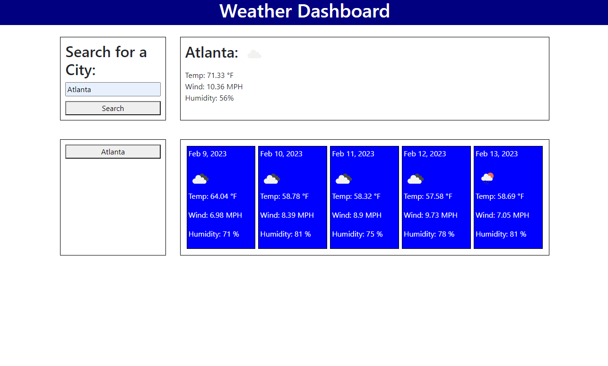
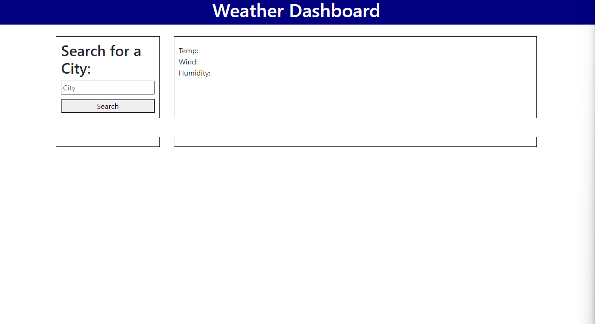
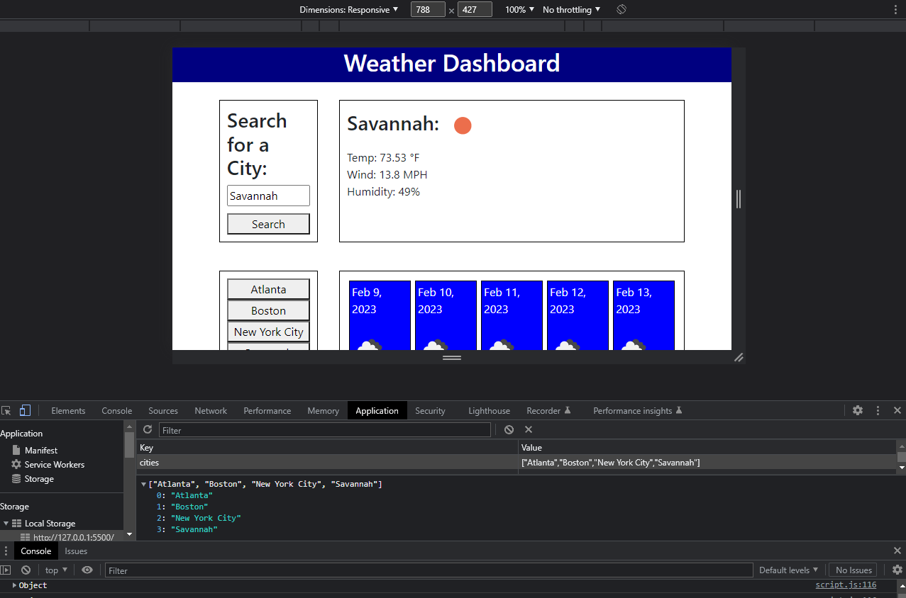

# <Weather-Dashboard>

## Description

The aim of the project was to make a weather dashboard using a weather API. The application is meant to be able to search for a city to pull up that days weather along with 5 days in the future. You were also meant to use local storage to keep functional buttons of previous searches after a refresh. Through working on this project I was able to develop a better understanding of how to navigate APIs and dynamically adding elements. I was able to work through all of the issues that I faced throughout this project. If I were to continue I would like to make more of the page function dynamically and add more styling. 

## Screenshots

## Link

https://cbarnes0.github.io/06-Weather-API/